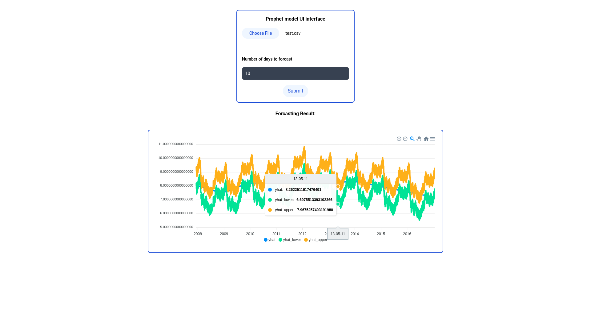

# Prophet-UI: Facebook Forecasting Model UI Interface

This repository contains a user interface (UI) interface for the [Prophet](https://facebook.github.io/prophet/) forecasting model. The Prophet model is a powerful tool for time series forecasting developed by Facebook's Core Data Science team. This UI interface allows users to easily interact with the Prophet model and generate accurate forecasts.



## Getting Started
<!-- using docker-compose -->
To get started with the Prophet forecasting model UI interface, follow the steps below:

1. install [Docker](https://docs.docker.com/get-docker/) and [Docker Compose](https://docs.docker.com/compose/install/)

2. Clone this repository:
```bash
git clone git@github.com:m0kr4n3/prophet-ui.git
```

3. Create a `backend/.env` file:
```bash
cp .env.example .env
```

4. docker-compose up
```bash
docker-compose up --build --detach
```

The application will be running on `http://localhost/`


